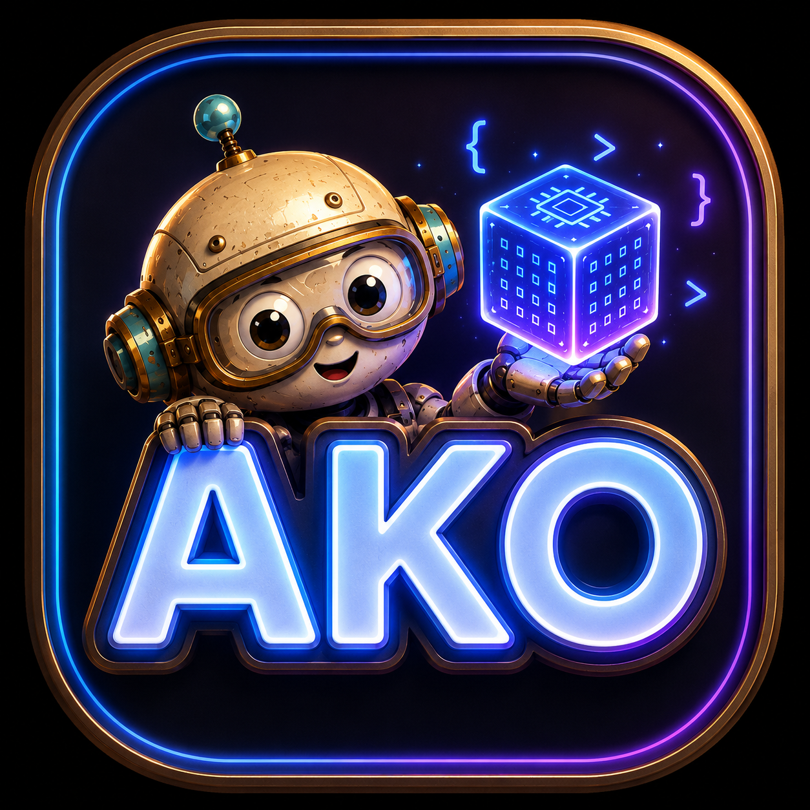

  

<h1 align="center">AKO</h1>

<b>Agentic Kernel Optimization</b>

  
  
  
  

<b>If you find our work useful, please consider giving us a star 🌟</b>

Achieve competitive GPU kernel performance in just hours.

**[Visit the project homepage →](https://tongminglaic.github.io/AKO)**

## Highlights

- **[AKO4X](https://github.com/TongmingLAIC/AKO4X)** wins all **5/5** MLSys-2026 FlashInfer-Bench contest kernels head-to-head against the rival [KDA](https://github.com/mit-han-lab/kernel-design-agents) system — up to **30.71×** over the FlashInfer expert.
- Beats the FlashInfer **expert** baseline across **10 operator families** on NVIDIA B200.
- **[AKO4ALL](https://github.com/TongmingLAIC/AKO4ALL)**, the drop-in skill, beats the expert on all **4 inference operators** — one prompt, **~1h** per kernel.

**[Full results on the project page →](https://tongminglaic.github.io/AKO#results)**

## News

<!-- On AKO tech-report release day, uncomment this entry (it is the newest — keep it on top) and fill in the date + link:
- 📄 **[YYYY.MM.DD]** The **[AKO tech report](<TECH_REPORT_LINK>)** is now available — the case for agentic over fixed-pipeline kernel optimization.
-->
- 🚀 **[2026.XX.XX]** [**AKO4X**](https://github.com/TongmingLAIC/AKO4X) is now open-source — the closed-loop, campaign-based system behind our [MLSys 2026 competition](https://mlsys26.flashinfer.ai/) entry.
- ✨ **[2026.XX.XX]** [**AKO4ALL**](https://github.com/TongmingLAIC/AKO4ALL) is now a single drop-in [Claude Code](https://docs.anthropic.com/en/docs/claude-code) skill — invoke it in any working directory.
- 🚀 **[2026.03.24]** [AKO4ALL](https://github.com/TongmingLAIC/AKO4ALL) is released. Check out the [project page](https://tongminglaic.github.io/AKO).

## Overview

AKO is **not** a new agent or model — it is a **harness** (optimization environment) for existing coding agents such as [Claude Code](https://docs.anthropic.com/en/docs/claude-code). It places the agent into a well-structured environment where the evaluation criteria, benchmarking tools, profiling interfaces, and optimization trajectory are all clearly defined and readily accessible.

## Tools

| Tool | Description | Repo |
|------|-------------|------|
| **AKO4ALL** | Open, minimal harness for any kernel, any hardware, any language. Bring your own benchmark or use the built-in [KernelBench](https://github.com/ScalingIntelligence/KernelBench) evaluator. | [TongmingLAIC/AKO4ALL](https://github.com/TongmingLAIC/AKO4ALL) |
| **AKO4X** | Advanced, eXtensible harness: closed-loop multi-round campaigns with cross-run memory, master/sub agent separation, and opt-in harness co-evolution. Benchmark-swappable via a thin adapter (default [flashinfer-bench](https://github.com/flashinfer-ai/flashinfer-bench)). | [TongmingLAIC/AKO4X](https://github.com/TongmingLAIC/AKO4X) |

## Tech Report

Coming soon — our tech report will detail why we advocate agentic approaches over fixed-pipeline methods for kernel optimization.
